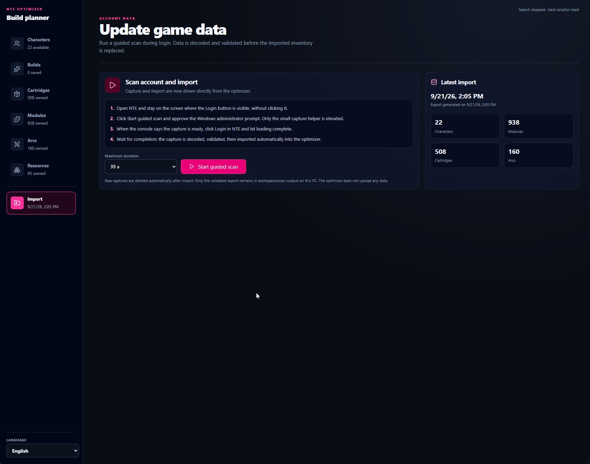
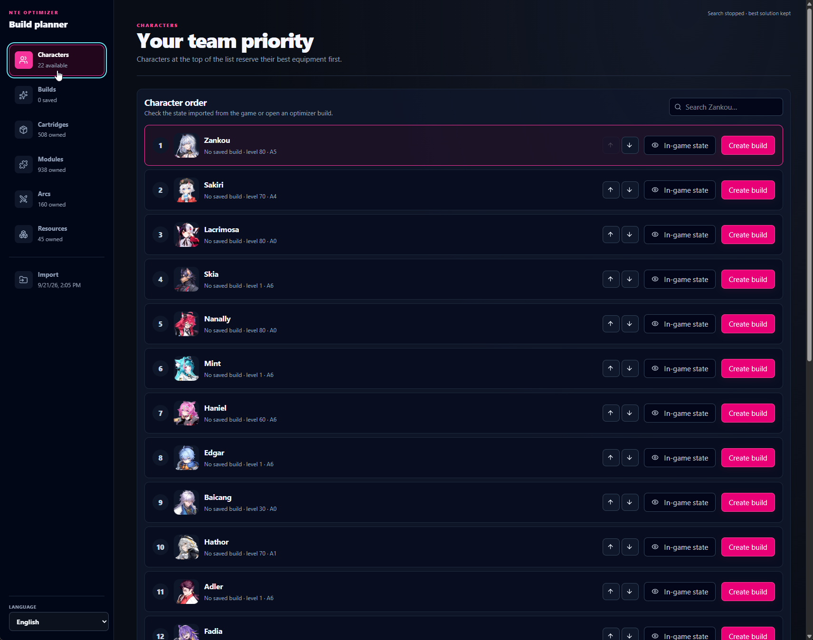
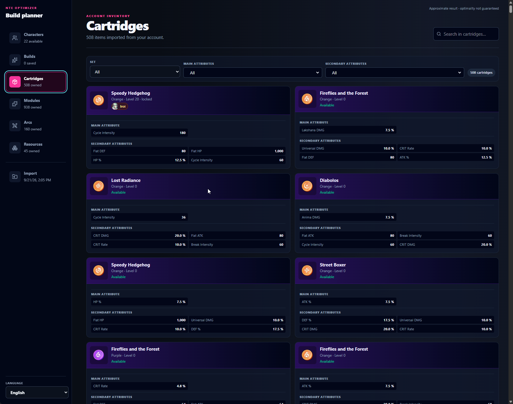
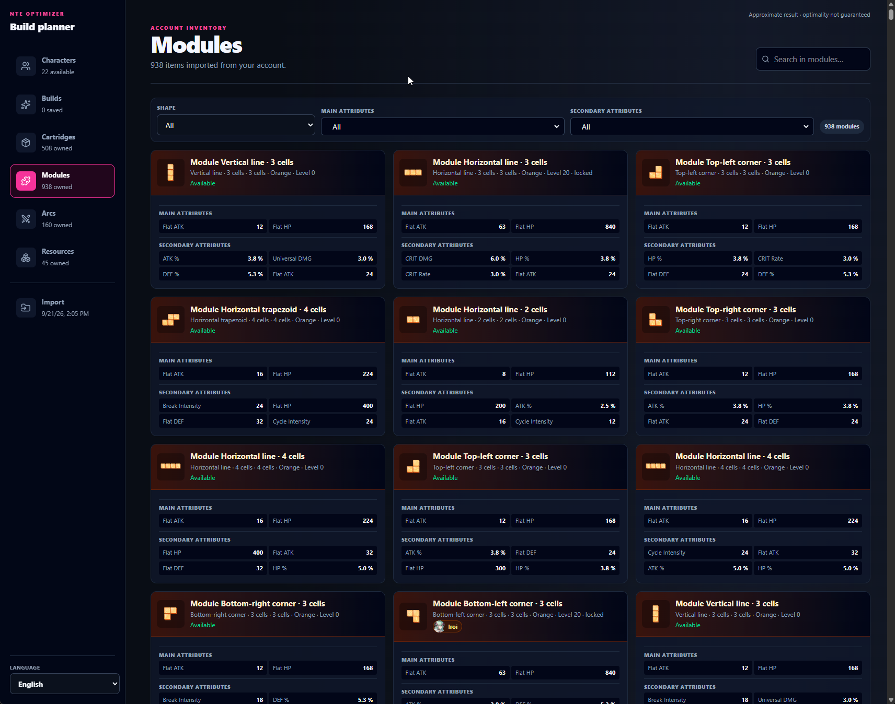
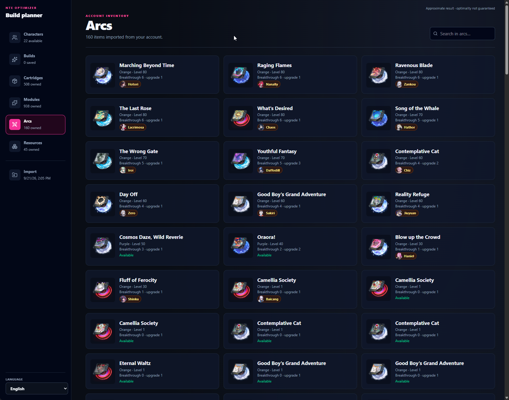
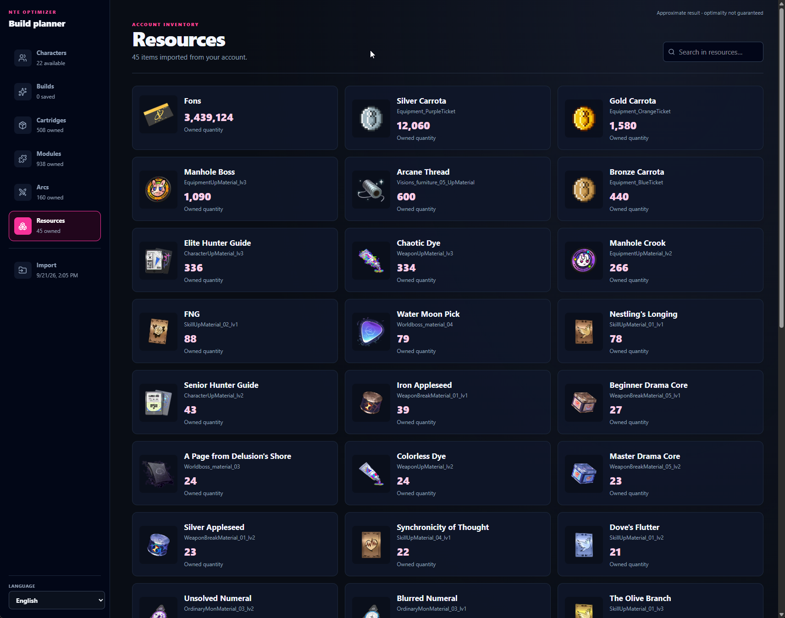

# Getting started

This guide covers installation, the first account scan, the main application
areas, updates, and uninstallation.

## Requirements

- Windows 10 or Windows 11;
- Microsoft Edge WebView2, normally included with supported Windows versions;
- Neverness to Everness installed and able to reach its login screen;
- permission to approve one Windows administrator prompt when scanning.

The packaged application does not require Go, Node.js, npm, or Wails.

## Install

1. Download `nte-optimizer-windows.zip` and its `.sha256` file from the release.
2. Optionally verify the archive from PowerShell:

   ```powershell
   Get-FileHash .\nte-optimizer-windows.zip -Algorithm SHA256
   ```

3. Extract the archive to a writable folder.
4. Start `nte-optimizer.exe`.

The archive contains the desktop application, the scanner helper, and the
static data required by the optimizer. It does not install a Windows service or
add a startup task.

## Import an account

1. Start NTE and stop on the login screen.
2. In NTE Optimizer, open **Import**.
3. Leave the default 35-second scan duration selected. Longer options are
   available for slower machines or connections.
4. Select **Start guided scan**.
5. Approve the Windows elevation prompt for `nte-scan.exe`.
6. Wait until the scanner console asks you to log in.
7. Log in to NTE and let the account finish loading.
8. The scanner stops, validates the decoded records, closes, and hands the
   result back to the desktop application.

The previous account import remains available if elevation is refused, capture
fails, or validation detects an incomplete result.



## Use the application

### Characters

The character list shows the imported roster. Reorder characters to establish
equipment priority: builds and currently equipped pieces belonging to a
higher-priority character are protected from lower-priority searches by
default.

Open a character to inspect imported progression, skills, current equipment,
and the account-specific values decoded at login.



### Builds

Choose a character strategy, search mode, desired main stat, and stat goals.
Each goal can define a target, tolerance, importance, strict minimum, or strict
maximum. Modules can be pinned or excluded before starting the search.

**Fast is currently the recommended search method.** It is the most effective
choice for routine optimization because it produces useful candidates without
waiting for the much larger search used by Balanced. Balanced can take a very
long time when an account owns many modules or when a character grid permits
many geometries, rotations, and placements.

The results table ranks valid combinations. Open a result for module placement,
set activation, stat provenance, conditional effects, and damage estimates.
Saving a build stores a local plan only; it does not equip anything in NTE.

### Cartridges and Modules

These pages expose the imported inventory with search and filters. They show
stats, level, set, lock state, current owner, and module geometry where
applicable.





### Arcs

The Arc list shows imported progression and ownership. Arc statistics and
supported passive effects are included in build projections.



### Resources

The Resources page shows the supported decoded currencies and materials. The
scanner may not recognize every item record immediately after a game update.



### Import

This page starts the guided scanner and summarizes the last successful import.
Direct folder import is intentionally not exposed in the user interface.

## Update

1. Close NTE Optimizer.
2. Extract the new archive over the previous application folder, or replace the
   old folder with the new one.
3. Start `nte-optimizer.exe`.

Account data and preferences live under `%LOCALAPPDATA%\NTE Optimizer`, outside
the extracted application folder, so replacing the application does not erase
them.

## Uninstall

Delete the extracted application folder. To also remove imported account data,
saved builds, and preferences, delete:

```text
%LOCALAPPDATA%\NTE Optimizer
```

These are separate steps so reinstalling the application can reuse existing
local data.

## Standalone scanner

Developers can run the scanner directly from an administrator PowerShell:

```powershell
go run .\cmd\nte-scan -login-capture -login-seconds 35 -output-dir "$env:LOCALAPPDATA\NTE Optimizer\workspace\scan-output"
```

Normal users should prefer the guided scan in the desktop application.

## Troubleshooting

### The administrator prompt was refused

No new import is published. Start the scan again and approve the prompt when
ready.

### The capture is incomplete

Retry with 45 or 60 seconds and wait for the account screen to finish loading.
The last successful import remains untouched.

### The scanner helper is missing

Use the complete release archive. `nte-optimizer.exe`, `nte-scan.exe`, and the
`data` directory must remain together.

### Windows blocks the executable

Only use releases obtained from a source you trust and verify the published
checksum. Windows may warn about unsigned community applications. Review the
release source and security model before choosing whether to run it.

### A game update changed imported values

The network format or game catalogs may have changed. Keep the previous export,
report the affected record, and update the generated game data or decoder before
trusting the new value.
