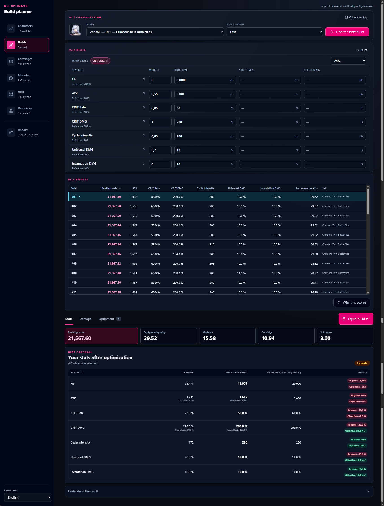
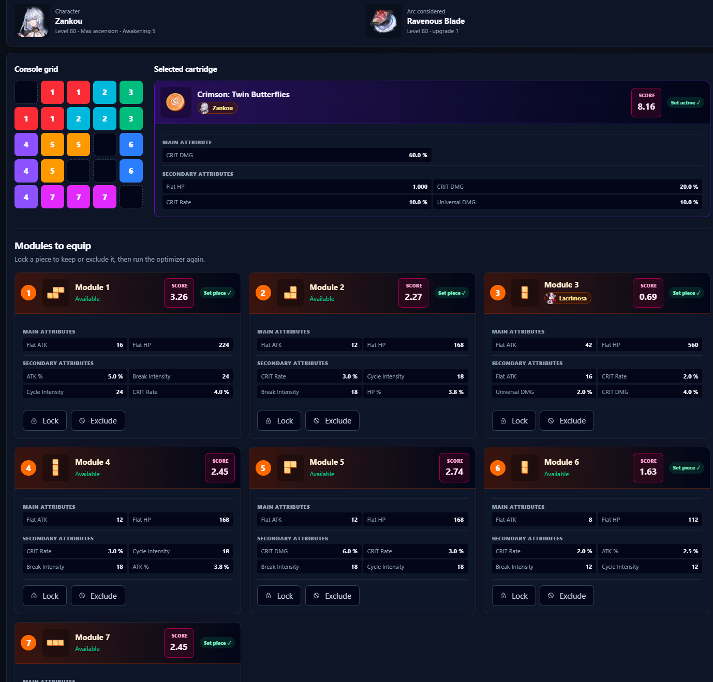
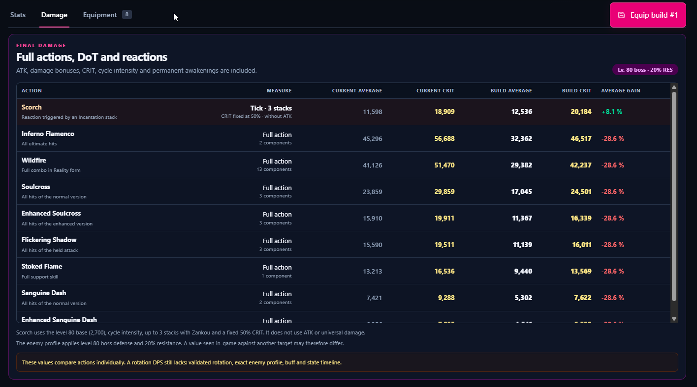

# Optimization model

This document explains how NTE Optimizer evaluates equipment and chooses a
build. The model is a planning aid, not a guarantee of in-game damage.

## Statistic sources

For each character, the application combines:

1. level- and breakthrough-specific panel data from
   `data/game/characters/base_stats.json`;
2. the base critical rate and critical damage rules used by the model;
3. supported panel stats and permanent effects from the equipped Arc;
4. module main and secondary stats;
5. cartridge stats and activated two-piece or four-piece set bonuses;
6. the character console trait for the relevant module area;
7. optional values from `account_overrides.json`.

Effects requiring a rotation, target state, stack count, or other combat
condition remain separate when the data supports that distinction. The normal
stat column contains guaranteed values; maximum effects contain conditional
projections.

## Recommendation weights

A strategy supplies an ordered stat priority. For example:

```text
Critical Rate > Critical Damage = ATK % > Flat ATK
```

The default rank weights are:

| Rank | Weight |
| --- | ---: |
| 1 | 1.00 |
| 2 | 0.85 |
| 3 | 0.70 |
| 4 | 0.55 |
| 5 | 0.40 |
| 6 | 0.25 |
| 7 and later | minimum 0.10 |

Stats joined by `=` receive the same weight. Cartridge main-stat preferences
are stored separately: they filter eligible cartridges but do not create an
additional score weight.

## Normalized equipment score

Each property has a reference value in `data/optimizer/references.json` so
different units can be compared.

```text
normalized value = effective value / reference value
contribution     = normalized value × strategy weight
equipment score = sum of contributions
```

For a critical-rate reference of `0.064`, a roll of `0.032`, and a weight of
`1.0`, the contribution is `0.50`.

If a profile defines a cap:

- value above the hard cap contributes nothing;
- value above the soft cap is multiplied by `after_soft_scale`;
- when that scale is absent, the default post-cap efficiency is 25%.

## Goals, tolerance, and importance

For target `C`, actual value `V`, and tolerance `T` between zero and one:

```text
ratio                = V / C
acceptable threshold = 1 - T
```

The target utility is:

```text
below threshold: utility = 0.9 × ratio / threshold
inside tolerance: utility = 0.9 + 0.1 × (ratio - threshold) / T
at or above target: utility = 1 + min(ratio - 1, 0.25) × 0.2
```

Its search contribution is:

```text
utility × importance × 10
```

The interface importance levels map to `0.5`, `1`, `2`, and `8`. Surplus value
stops improving utility after 125% of the target, at a maximum utility of
`1.05`. This prevents one heavily overcapped stat from overwhelming every other
goal.

Strict minimums and maximums are hard constraints. A result that violates one
is rejected rather than merely receiving a lower score.

## Sets and cartridges

Each recommended set variant appears as a selectable strategy. The solver only
uses cartridges owned by the imported account and checks whether the selected
module geometry activates the best reachable set tier.

```text
set score   = score of the activated tier
build score = module score + cartridge score + set score
```

Goal-oriented search also uses internal guidance for the preferred set and grid
occupancy. That guidance affects search selection but is not displayed as a
separate final score.

## Search process

### Choosing a search method

**Fast is the recommended mode for current versions of the application.** It
reduces the candidate space enough to provide the most practical balance of
result quality and execution time for everyday use.

Balanced retains and evaluates substantially more combinations. Because every
module may introduce different geometry, rotation, position, set, and stat
possibilities, its running time can grow quickly with inventory size and grid
complexity. Balanced is therefore best reserved for deliberate, longer searches
where the user is prepared to wait or stop the calculation and keep the best
result found so far.

The optimizer:

1. excludes equipment reserved by higher-priority characters unless reuse is
   allowed;
2. ranks modules by weighted score and efficiency per occupied cell;
3. keeps strong candidates across geometry and set groups;
4. generates valid rotations and positions;
5. explores combinations without overlap;
6. evaluates modules, cartridge, set, final stats, and goals together;
7. refines same-geometry substitutions in goal-oriented mode.

The exact solver uses an upper bound to discard branches that cannot beat the
current best result. Goal-oriented search avoids that bound during its main
non-linear scoring pass.



## Result interpretation

The displayed build score is useful for comparing candidates under the same
character strategy. It is not a universal quality percentage and should not be
compared across unrelated profiles.

`complete: true` means the retained search space was fully explored. If the
user stops a search, the application returns the best candidate found so far
with `complete: false`.



Damage estimates use the structured combat rules currently available in
`data/game/combat/damage.json`. Missing or conditional rules are reported rather
than silently presented as guaranteed damage.


